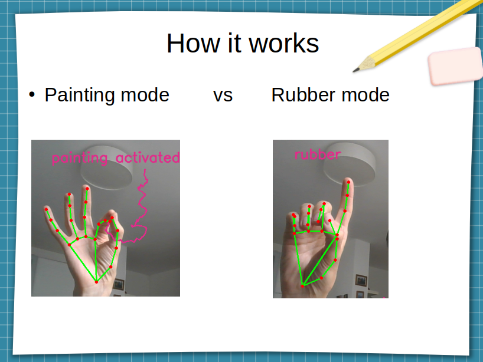

# Intro
In july 2019 Google released mediapipe, a cross-platform, customizable ML solution for live and streaming media. In this project the mediapipe hands module is utilized to create a simple tool for painting to the webcam with the fingers by moving the hand in the front of the camera. It also has the ability to delete the painting in the rubber mode. This code is not aimed to be production ready, but is created to show up the abilities and also problems that arise while using the mediapipe framework.

# Quick Start Guide
##  1. Create a Virtual Camera

You need to create a virtualcam somehow. For linux (ubuntu 20.04) its tested with `v4l2loopback-utils`:

   1. Install `sudo apt-get install v4l2loopback-utils` (NOTE: If you have secure-boot installed, deactivate it or register the module as guided in the prompt showing up.)
   2. Check your cameras with `v4l2-ctl --list-devices`
   3. Create the virtualcam on a free `video_nr`, eg. `/dev/video4`: `sudo modprobe v4l2loopback devices=1  exclusive_caps=1 video_nr=4 card_label="v4l2loopback"` (to make it permanent see docu above)

## 2. Run with docker-compose

1. Configure the `docker-compose.yaml` to fit to your camera input and output:
    - Configure the correct devices for in- and output: Currently `/dev/video2` (line `7`) and `/dev/video4` (line `8`) is configured.
    - Configure the correct command line arguments for the python application in line `9`:
        - The first one is the input (currently `2`), 
        - the second one ist the virtual camera output (currently `4`).
        - (Optional): You can add the third command line argument `"DEBUG"` to activate the debug mode. With this mode you can see the skeleton of the mediapipe hand recognition.
2. Create docker image: `docker build -t paint-to-webcam .`
3. start the program `docker-compose up`
3. Open microsoft teams (or any other app, that uses video input) and choose the camera `v4l2loopback` as your camera input. (Maybe you have to restart teams, that it shows up.)

## 3. Usage
1. Paint
    - The app recognizes your fingers, if held in front of the camera. If the index finger tip is close to the thumb finger tip, then the painting mode is activated.
    - Achieve the best results with good light sources and the full hand visible to the camera. 
2. Rubber
    - Is activated, if the index finger is straight and at least one of middle-, ring-, or pinky-finger is bent.
3. Illustration:
   

# Documentation

## Install mediapipe
Best use docker. Otherwise:
1. `mkvirtualenv mediapipe` (requires virtualenvwrapper)
2. `workon mediapipe`
3. `pip install requirements.txt`   
4. `pip install mediapipe`
5. `apt-get install ffmpeg libsm6 libxext6`

## Create docker image
1. `docker build -t paint-to-webcam .` (uses the Dockerfile)
2. Run it with docker-compose (see quick start guide). But if you want to run it with `docker run`, then use `docker run --device /dev/video2 --device /dev/video4 paint-to-webcam python "./app/paint_to_webcam.py" 2 4 DEBUG` (Configure the device numbers accordingly!)

## install pyfakewebcam (linux)
1. `workon mediapipe`
2. `pip install pyfakewebcam`
3. `apt-get install v4l2loopback-utils` (to install further dependencies see https://github.com/jremmons/pyfakewebcam)
4. `sudo modprobe v4l2loopback devices=1  exclusive_caps=1 video_nr=4 card_label="v4l2loopback"` -> creates virutal cam `dev/video4`.
5. (optional) To make the camera permanent:
   - create file: `/etc/modprobe.d/v4l2loopback.conf` with content `options v4l2loopback devices=1  exclusive_caps=1 video_nr=4 card_label="v4l2loopback"`
   - create file: `/etc/modules-load.d/v4l2loopback.conf` with content `v4l2loopback`
6. run `python3 pyfakewebcamexample.py` (assumes video output on `dev/video4`) Camera alternating between red and blue. 
7. Choose camera in teams (or any other app) or run `ffplay /dev/video4`

## links
- Blogpost: https://www.redlink.at/paint-to-webcam-hand-detection-mit-mediapipe/
- https://google.github.io/mediapipe/
- https://dannadori.medium.com/how-to-edit-the-image-stream-for-video-chat-teams-zoom-3acb58669f26
